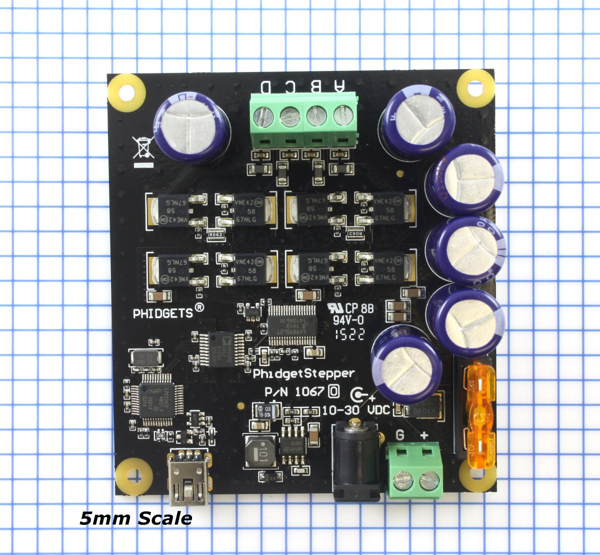
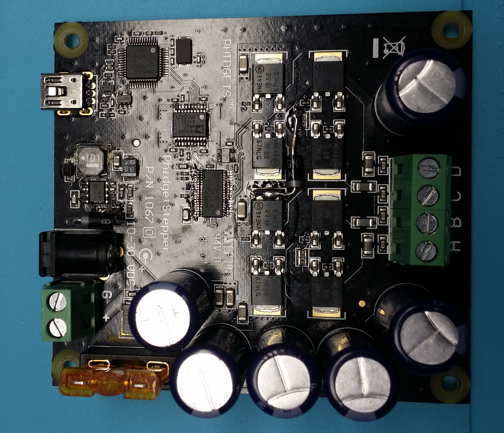

I use a few of these [PhidgetStepper 1067](https://www.phidgets.com/?prodid=1029) devices.  They are a flawed design.

## Circuit Description

The circuit is arranged in two parts, the controller part and the driver part.  The two parts are galvanically isolated.

The controller consists of a [LPC1343](https://www.nxp.com/docs/en/data-sheet/LPC1311_13_42_43.pdf).  It runs on 3.3 V derived from the USB +5V power.

The driver consists of an Allegro [A4989](https://www.allegromicro.com/~/media/Files/Datasheets/A4989-Datasheet.ashx?sc_camp=64EB2DD6B3FE4C088C07DB87D) stepper driver and an [MC34063](http://www.st.com/content/ccc/resource/technical/document/datasheet/03/f9/c4/3d/7f/eb/4c/5e/CD00001232.pdf/files/CD00001232.pdf/jcr:content/translations/en.CD00001232.pdf) buck converter circuit that generates a 5V logic supply.  At the input for the motor voltage there is a series [diode](https://www.vishay.com/docs/89006/v10p10.pdf) for protection against reversed inputs, and an automotive blade-type fuse.  The enable to the driver IC is active low, but the signal from the controller is active high (thus ensuring the driver is off when the USB cable is disconnected.)  A [single-gate inverter](https://assets.nexperia.com/documents/data-sheet/74AHC_AHCT1G04.pdf) translates the level.

The three control commands and enable signal are bridged with an [ADUM3480](http://www.analog.com/media/en/technical-documentation/data-sheets/ADuM3480_3481_3482.pdf).  This part connects with the 3.3 V supply on the controller side and a 5 V supply on the driver side.

## Experience

One of my test fixtures is a weighted bicycle wheel on a stepper, driven by a PhidgetStepper 1067. There is no dissipative load on the wheel.

I spun this wheel up to about 15 mph.  The controller broke.

I had to do some more testing, so I swapped in another controller board.  It broke at 20 mph.

Examination of the failure showed the current sense resistor (0.56 ohm, 0603) on the MC34063 was burned open, and parts on the downstream +5v were damaged.  The pins of the inverter gate were shorted together, and the ADuM3480 was no longer transferring signals from the controller to the driver.

## The flaw

The controller design has no place to dump the energy on overrun or external spinning of the stepper.

When the energy is applied it is dumped into the power supply rail.  The voltage in the rail increases.  The series diode prevents this energy from exiting the controller board, so no adjustment of the power supply can save the board from its fate.  When it gets above the buck converter's 40 V rating, it destroys the buck converter, which places the full voltage on the 5V bus.  This destroys the ADuM3480 and inverter, and maybe the A4989.

## The fix

I ordered some spare parts from Digikey to repair the damaged boards.

I also ordered some beefy 1N5365 36V Zeners to add across the power supply (downstream from the diode.)  They should provide a place for the extra energy to go.  Or a least make a more spectacular failure.

| Part          | Digi-Key number                                                                  |
|---------------|----------------------------------------------------------------------------------|
| A4989         | [620-1389-1-ND](https://www.digikey.com/product-detail/en/x/620-1389-1-ND)       |
| ADuM3480      | [ADUM3480ARSZ-ND](https://www.digikey.com/product-detail/en/x/ADUM3480ARSZ-ND)   |
| MC34063       | [497-7850-1-ND](https://www.digikey.com/product-detail/en/x/497-7850-1-ND)       |
| 74AHCT1G04    | [1727-6023-1-ND](https://www.digikey.com/product-detail/en/x/1727-6023-1-ND)     |
| 0.56 ohm 0603 | [P17441CT-ND](https://www.digikey.com/product-detail/en/x/P17441CT-ND)           |
| 36V 5W Zener  | [1N5365BTPMSCT-ND](https://www.digikey.com/product-detail/en/x/1N5365BTPMSCT-ND) |

## Diode placement

I put one diode on the H-bridge itself with short leads.  This should help the power dissipation of the diode. I added another diode at the power input to the MC34063 circuit. This diode, combined with trace resistance between the H-bridge and power supply, should add an extra layer of protection against transient overvoltages.

## Results

The repaired board worked right away.

The board modified with Zeners still works after several cycles of 25 mph.
